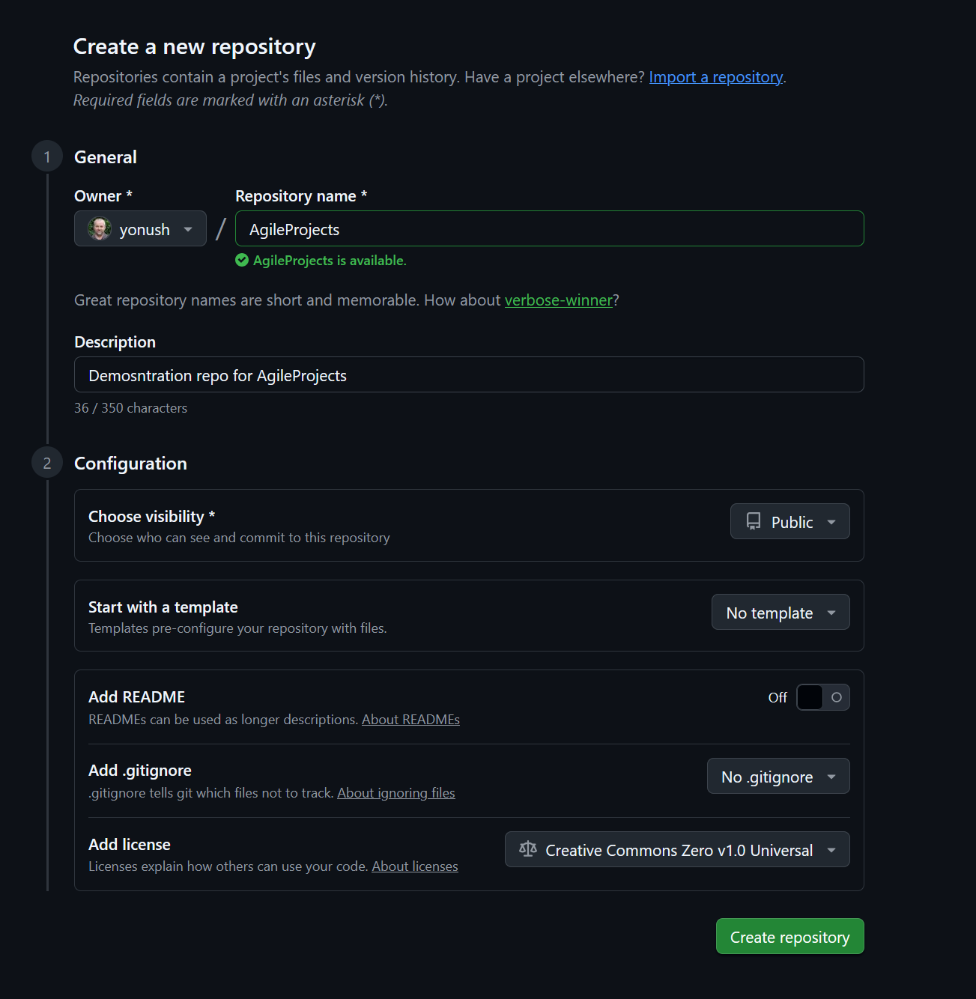
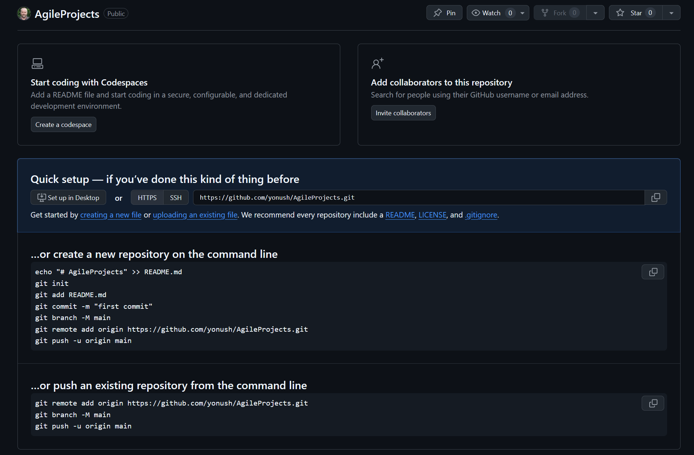
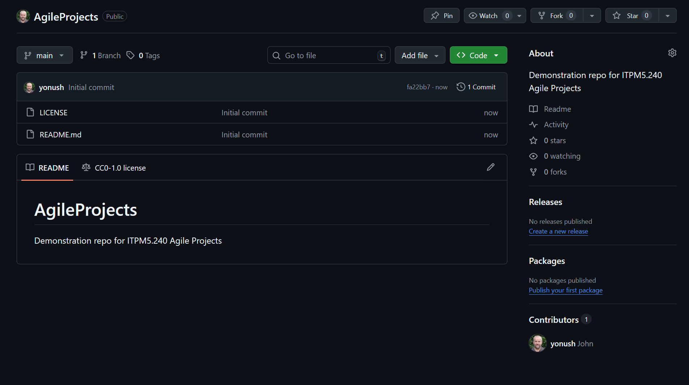

# Demonstration Git repository for ITPM5.240 Agile Projects  

this is a modification
## 1. Create GitHub repo with gh

1. Download and install gh from https://cli.github.com/
2. Enter _gh repo create_ and follow the instructions.
3. Check the authentication status _gh auth status_
4. Login using _gh auth login_.
   If you encounter authentication issues then follow the steps on authentication below before attempting to upload a repository.

### 1.1 Using the web interface

browse to https://github.com and create it using the web interface
**New repo**


**Empty repo**


**Repo preloaded with readme and licence**


## 2. Empty Repo with no files

Instructions if the repository was empty:

```shell
echo "# AgileProjects" >> README.md
git init
git add README.md
git commit -m "first commit"

git branch -M main
git remote add origin https://github.com/yonush/AgileProjects.git
git push -u origin main
```
Refer to the Tokens below for authentication.

## 2. Existing local repo with files

Instructions for an existing local repository:

``` shell
git remote add origin https://github.com/yonush/AgileProjects.git
git branch -M main
git push -u origin main
```


## Authentication

Authenticating with a token:

``` shell
git remote set-url origin https://yonush:<MYTOKEN>@github.com/yonush/AgileProjects.git
```
Authentication with gh:

1. Download and install gh from https://cli.github.com/
2. With the web
	gh auth login --web
3. git config --global credential.helper "!gh auth git-credential"
	(my default helper !"C:/go/git/mingw64/bin/git-credential-manager.exe")
4. With a token 
	echo your_token | gh auth login --with-token


**Personal Access Token (Manual)**
	git config credential.helper store
	git push origin main
	  Enter username and token when prompted
	  
gh auth status
gh auth logout

### Generate a Personal Access Token manually
1. Log in to GitHub:

	Go to GitHub and sign in to your account.
	
2. Access Token Settings:

    Click on your profile picture in the upper-right corner and select Settings.
    In the left sidebar, click Developer settings.
    In the left sidebar again, click Personal Access Tokens then Tokens (Classic).

3. Generate New Token:

    Click on Generate new token (classic).
    Give your token a descriptive name (e.g., "Git push access").
    Select the scopes or permissions you need. 
	For pushing to repositories, you will need repo (full control of private repositories).

4. Generate and Copy Token:

    Click Generate token.
    Copy the token to your clipboard. 
	NOTE: You won't be able to see this token again, so store it securely.

## Resources
- [GitHub CLI](https://cli.github.com/)
- [GIT CLI](https://git-scm.com/install/windows)
- [PMBOK](https://pmbok.guide/)
- [A collection of useful .gitignore templates](https://github.com/github/gitignore)
- [Learn Git Branching](https://learngitbranching.js.org/)	
